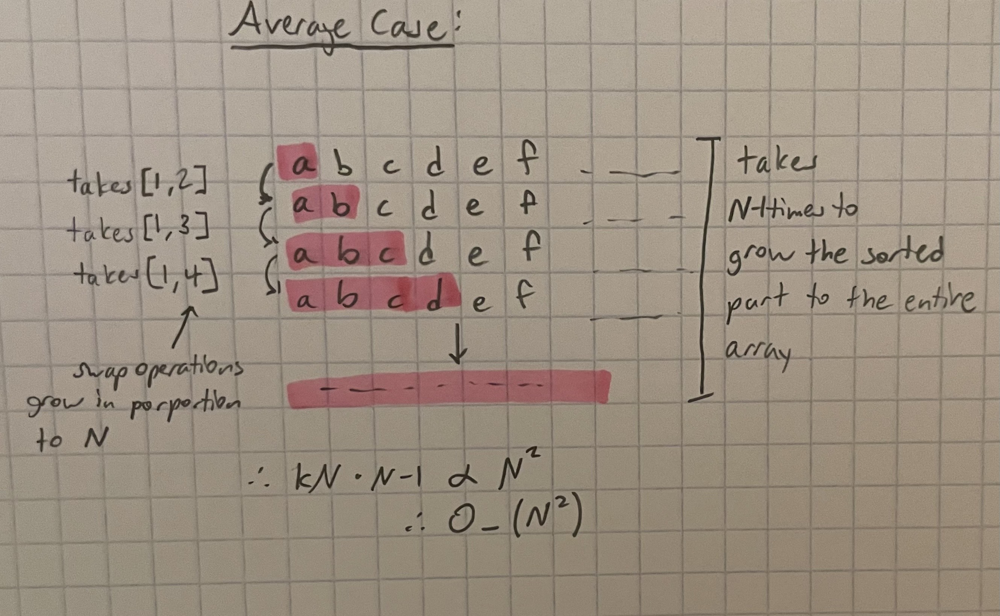
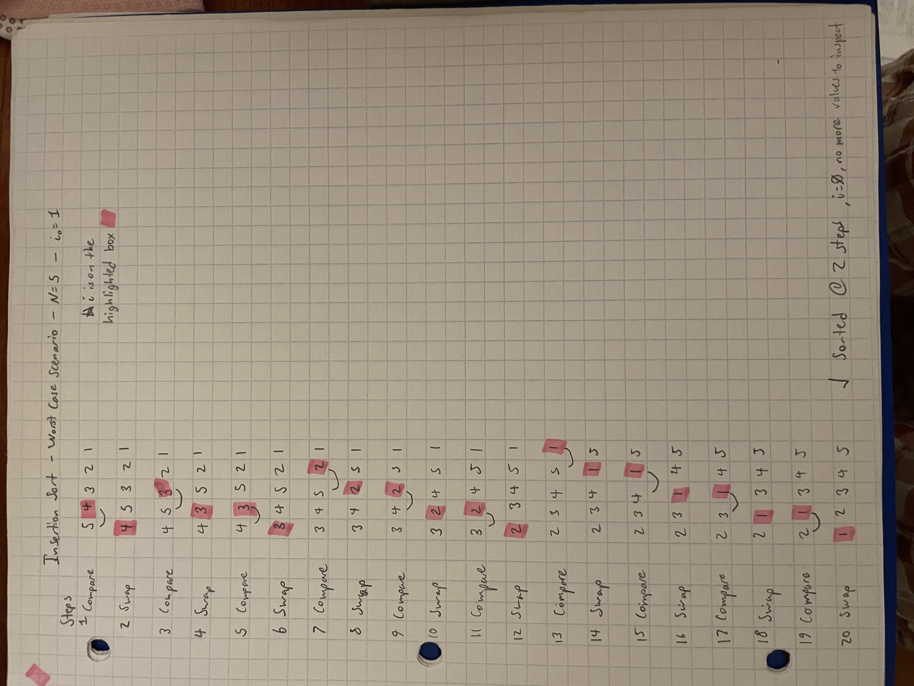

# Week 3 Activity - Sorting 2
Alexandra Steiner - 9/22/25

Video Link: https://youtu.be/4JuMdyMIYoY

## 1 - Proof that, under the average-case scenario, the insertion sort has a time complexity of $O(N^2)$. Draw a clear figure and show all the operations clearly.  **2 pts **
An insertion sort needs to grow the sorted region of the array by N-1 times. Each growth requires a minimum of 1 compare and anywhere between 0 to the number of values in the sorted region steps to increase the number of values in the sorted region by one. Since, in an average array, the range of steps grows porportionally to N and this happens N-1 times, it is clear that the insertion sort has a time complexity of N^2



## 2- At the start of the insertion sort, the index of the inspected value is set to 1. Change the index of the inspected value and verify that the total number of operations equals 20. Consider the worst-case scenario. Use N=5, where N is the number of elements.  **4 pts**



## 3- The following function returns whether or not a capital “X” is present within a string.  **4 pt**
```
function containsX(string) {
	foundX = false;
	for(let i = 0; i < string.length; i++) { 
		if (string[i] === "X") {
			foundX = true; 
		}
	}
	return foundX; 
}
```

**(a) What is this function’s time complexity regarding Big O Notation?**
O_(N)

**(b) Then, modify the code to improve the algorithm’s efficiency for best- and average-case scenarios.**
- Best case is where X is the first character in the string. In the Best Case this only takes 1 step
- This method also improves the average case since it'll stop once X has been found

```
function containsX(string) {
	for(let i = 0; i < string.length; i++) { 
		if (string[i] === "X") {
			return true
		}
	}
	return false
}
```