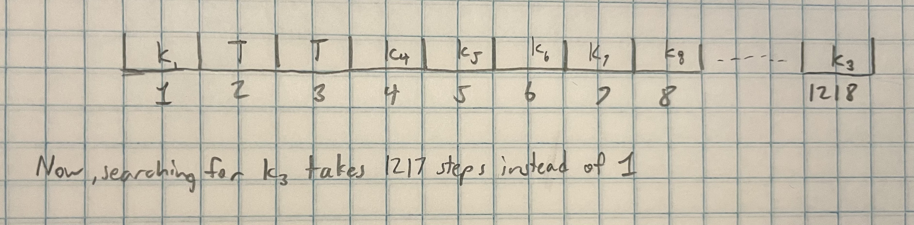

# Week 5 Activity - Hash Tables
Alexandra Steiner

## 1. Assume you have a simple single-dimensional array

```array = [200, 400, 100, 50, 350]```

### Linear search will take $O(N)$. Write a code in C++/Python to improve the search operation efficiency from $O(N)$ to $O(1)$. **4 pts **
```cpp
/*
std::unordered_map is an associative container that contains key-value pairs with unique keys. Search, insertion, and removal of elements have average constant-time complexity. - https://en.cppreference.com/w/cpp/container/unordered_map.html
*/
std::unordered_map<int, int> array = {{200,0},{400,1},{100,2},{50,3},{350,4}}; // <value, index>

std::cout << array[100]; // prints the index of 100 (2)
```
**Output:**
`2`

## 2. Use C++, generate hash value of your name. **1 pts**
Lets do a simple additive hash function

```cpp
std::size_t generateHash(std::string s) {
    std::size_t h = 0;
    for (int i = 0; i < s.length(); i++) {
        h += (int)s[i]; // Add the ASCII value of each character
    }
    return h;
}

// Generate a hash of your name
std::string myName = "Alexandra C Steiner";
auto h = generateHash(myName);
std::cout << "Hash of " << myName << " is: " << h << std::endl;
```

**Output:**
`Hash of Alexandra C Steiner is: 1773`

## 3. With the help of a figure, explain the problem that occured due to introducing a __tombstone__ to mark the deleted cell. **5 pts**
Lets say that there was a collision at index 2 and a key that hashes to index 2 needed to be placed at the index 1218 or some far away index. Then, if there was only tombstones between index 8 and 1218 due to deleting a bunch of values from the hash table, you would end up needing to check 1217 cellls just to search for that key in a hash table with only 7 values.


