# Week 6 Activity - Stacks and Queues
Alexandra Steiner

Video Link: 

## Using Figure 17 as a model, in the book [Data Structures in C++](https://d-khan.github.io/ds), illustrate the result of each operation in the sequence PUSH(S,4), PUSH(S,1), PUSH(S,3), POP(S), PUSH(S,8), and POP(S) on an initially empty stack $S$ stored in array $S[1..6]$. ***Code is not required.*** **3 pts** 
Initial Empty Array `S[1..6]`

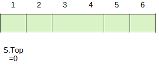

`PUSH(S,4)`

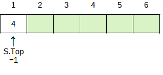

`PUSH(S,1)`

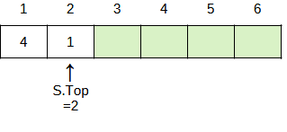

`PUSH(S,3)`

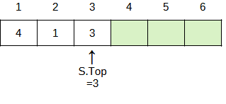

`POP(S)` (Returns 3)

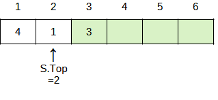

`PUSH(S,8)`

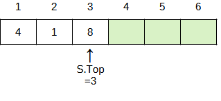

`POP(2)` (Returns 8)


## Using Figure 18 as a model, in the book [Data Structures in C++](https://d-khan.github.io/ds), illustrate the result of each operation in the sequence ENQUEUE(Q,4), ENQUEUE(Q,1), ENQUEUE(Q,3), DEQUEUE(Q), ENQUEUE(Q,8), and DEQUEUE(Q) on an initially empty queue $Q$ stored in array $Q[1..6]$. ***Code is not required.*** **3 pts**

Initial Empty Array `Q[1..6]`

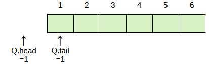

`ENQUEUE(Q,4)`

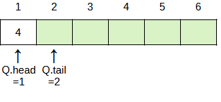

`ENQUEUE(Q,1)`

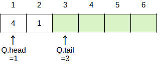

`ENQUEUE(Q,3)`

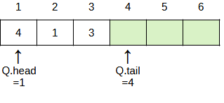

`DEQUEUE(Q)` (Returns 4)

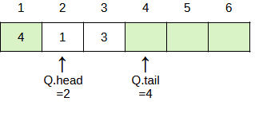

`ENQUEUE(Q,8)`

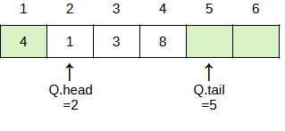

`DEQUEUE(Q)` (Returns 1)

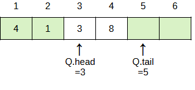

## Rewrite ENQUEUE and DEQUEUE to detect ***underflow*** and ***overflow*** of a queue. (see Listings 4 & 5 in the book). ***Code is not required.*** **1 pt**

### ENQUEUE CODE (Rewritten to detect overflow)
```
if (Q.tail + 1) == Q.head || (Q.tail + 1 - Q.length) == Q.head
    throw error("Queue Overflow")
else
    Q[Q.tail] = x
    if Q.tail == Q.length
        Q.tail = 1
    else Q.tail = Q.tail + 1
```

### DEQUEUE CODE (Rewritten to detect underflow)
```
if Q.head == Q.tail
    throw error("Queue Underflow)
else
    x = Q[Q.head]
    if Q.head == Q.length
        Q.head = 1
    else Q.head = Q.head + 1
return x
```

## A stack allows insertion and deletion of elements at only end, and a queue allows insertion at one end and deletion at the other end, a **deque** (double-ended queue) allows insertion and deletion at both ends. Write four $O(1)$-time procedures to insert elements into and delete elements from both ends of a deque implemented by an array. ***Code is not required.*** **3 pts**

For a queue implemented in an array `D[1..N]` where `D.length = N`
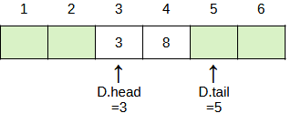


### Insertion at Front of Deque
```
if (D.tail + 1) == D.head || (D.tail + 1 - D.length) == D.head
    throw error("Deque Overflow")
else
    if D.head == 1
        D.head = D.length
    else
        D.head = D.head - 1
    D[D.head] = x
```

### Deletion at Front of Deque
```
if D.tail == D.head
    throw error("Deque Underflow")
else
    x = D[D.head]
    if D.head == D.length
        D.head = 1
    else
        D.head = D.head + 1
    return x
```

### Insertion at End of Deque
```
if (D.tail + 1) == D.head || || (D.tail + 1 - D.length) == D.head
    throw error("Deque Overflow")
else
    D[D.tail] = x
    if D.tail == D.length
        D.tail = 1
    else
        D.tail = D.tail + 1
```

### Deletion at End of Deque
```
if D.tail == D.head
    throw error("Deque Underflow")
else
    if D.tail == 1
        D.tail = D.length
    else
        D.tail = D.tail - 1
    return D.tail
```
