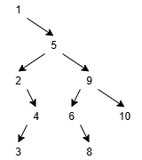

# Activity 8 - Binary Trees
Alexandra Steiner

Video Link: https://youtu.be/cX5cWOjZzoE

## Imagine you were to take an empty binary search tree and insert the following sequence of numbers in this order: [1, 5, 9, 2, 4, 10, 6, 3, 8]. Draw a diagram showing what the binary search tree would look like. Remember, the numbers are being inserted in the order presented here. (2 points)


## If a well-balanced binary search tree contains 1,000 values, what is the maximum number of steps it would take to search for a value within it? (1 point)
A well balanced binary search tree has 2^N elements per level, so lets make a table:

| Layers | Max Elements |
|--------|--------------|
| 1      | 1            |
| 2      | 3            |
| 3      | 7            |
| 4      | 15           |
| 5      | 31           |
| 6      | 63           |
| 7      | 127          |
| 8      | 255          |
| 9      | 512          |
| 10     | 1023         |

Therefore, a perfectly balanced binary search tree would have a minimum of 10 layers.
## Write an algorithm that finds the greatest value within a binary search tree. 2 points)
Here's some psuedocode
```cpp
struct NODE {
    NODE rightNode
    NODE leftNode
    var value
}

NODE currentNode = Tree.root
while (currentNode.rightNode != NULL) {
    currentNode = currentNode.rightNode
}

var greatestValue = currentNode.value
```

## Write a code in C++ using the same array mentioned in #1 and implement a binary search tree. Only insertion operation is required. (5 points)
Sure!
```cpp
#include <stdio.h>
#include <stdlib.h>
#include <iostream>

template<typename T>
struct Node {
    Node *rightNode; // Bigger value
    Node *leftNode; // Smaller value
    T value;
    Node (T val) {
        value = val;
    }
};

template<typename T>
class SearchyBinTree {
    public:
    Node<T> *root;

    SearchyBinTree() {
        root = NULL;
    }

    void Insert(T val) {
        // Instantiate and allocate for a new node with the expected value
        Node<T> *newNode = new Node<T>(val);

        // If this tree is empty, put the value at the root
        if (root == NULL) {
            root = newNode;
            return;
        }

        Node<T> *currentNode = root;
        while (val != currentNode->value) { // If we find the exact same value, the insert fails
            if (val > currentNode->value) { // Greater Than
                if (currentNode->rightNode != NULL) currentNode = currentNode->rightNode;
                else {
                    currentNode->rightNode = newNode;
                    return;
                }
            }
            else { // Less Than
                if (currentNode->leftNode != NULL) currentNode = currentNode->leftNode;
                else {
                    currentNode->leftNode = newNode;
                    return;
                }
            }
        }
    }
};


SearchyBinTree<int> *myTree = new SearchyBinTree<int>();
//[1, 5, 9, 2, 4, 10, 6, 3, 8]
int main() {
    myTree->Insert(1);
    myTree->Insert(5);
    myTree->Insert(9);
    myTree->Insert(2);
    myTree->Insert(4);
    myTree->Insert(10);
    myTree->Insert(6);
    myTree->Insert(3);
    myTree->Insert(8);

    return 1;
}

```
