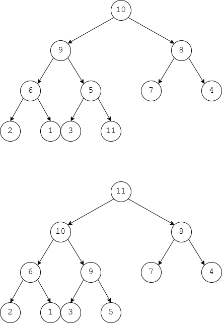
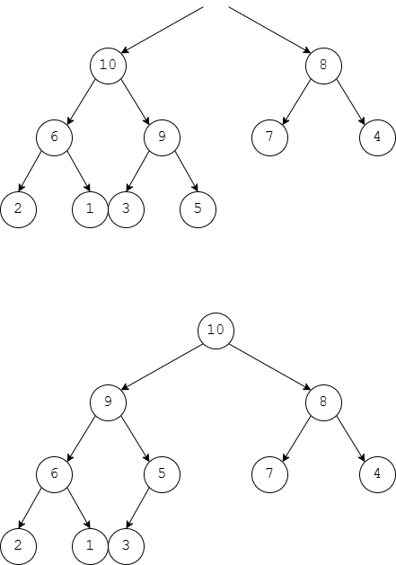
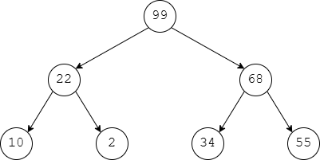
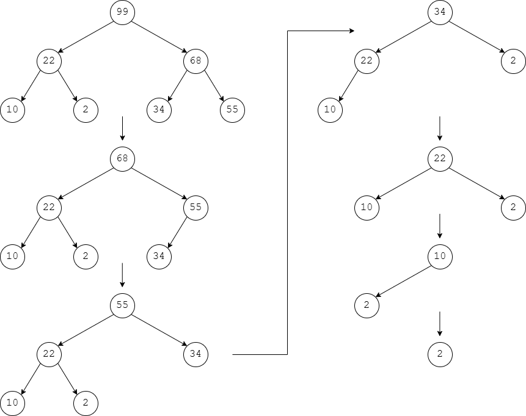

# Activity 9 - Binary Heaps
Alexandra Steiner

Video Link: https://youtu.be/F9gEHAt4FVg

## 1. Draw what the following heap would look like after we insert the value 11 into it:

**Original Heap**

**Heap after insertion then after percolation:**

## 2. Draw what the previous heap would look like after we delete the root node.
**Heap after deletion then after percolation:**

## 3. Imagine you’ve built a brand-new heap by inserting the following numbers into the heap in this particular order: 55, 22, 34, 10, 2, 99, 68. If you then pop them from the heap one at a time and insert the numbers into a new array, in what order would the numbers now appear?

So, for each node the position would be given by `2*k` for left nodes and `2*k+1` for right nodes. Lets assume that the binary heap is ordered with the root being the greatest number. First, lets build the heap tree:

Now that we've built the tree, lets make an array out of it using the `2k` and `2k+1` rules for child nodes

| Index | 1  | 2  | 3  | 4  | 5 | 6  | 7  |
|-------|----|----|----|----|---|----|----|
| Value | 99 | 22 | 68 | 10 | 2 | 34 | 55 |

Now, if we pop elements off of the heap and append them to the end of an array, we should get an array `[99,22,68,10,2,34,55]

**But you might have meant: pop the root node off the binary heap and append it to an array. Then percolate the heap before popping the new root off**

This would result in trees that look like this:

And, if outputted to an array, would result in `[99,68,55,34,22,10,2]`